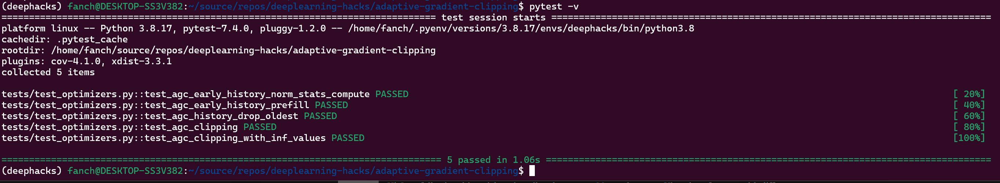
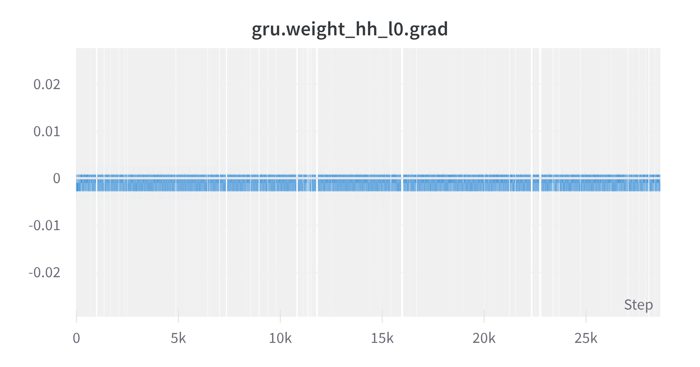
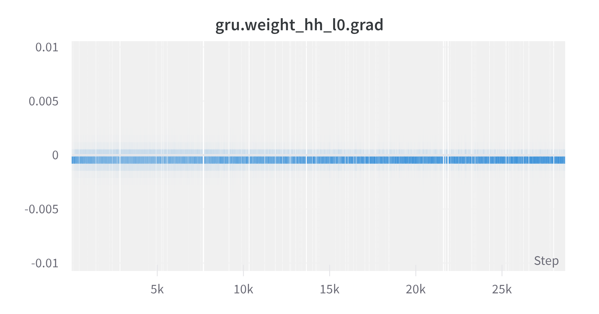

# Adaptive Gradient Clipping

This project is to replicate a technique used to train state-of-the-art RNN models. In
the classic paper ["On the difficulty of training Recurrent Neural Networks"](https://arxiv.org/pdf/1211.5063.pdf), they introduce the idea of gradient clipping in section "3.2. Scaling down the gradients". Most models today are trained with gradient clipping set at a constant threshold.

However, it's not well known that this paper also describes a way to clip gradients without adding an additional threshold. The paper goes on to describe a heuristic for setting a threshold.

Initially, I spent quite some time working on an adaptive gradient clipping approach based on the ratio of the norm of gradients to the norm of parameters. This is a rather recent development described in [Brock et al. (2021)](https://arxiv.org/pdf/2102.06171.pdf).

Later on, I figured I would try to come up with a simple heuristic that would use the history of gradient norms over a sufficient time window. I figured I could simply clip those gradients whenever they deviate too much from their historical average. I opted to use a rather conservative (clip more often than not) threshold and settled for one standard deviation from the mean (to the upside).

I tried to provide at least a few essential unit tests, that are all passing.



I integrated the clipper in the seq2seq translation notebook provided in the Pytorch tutorials, and used it to clip gradients on the decoder side only for the sake of simplicity ( I would need a second instance of my clipper with its own history if I wanted to clip the encoder gradients as well).

I hooked up the notebook to a Weights&Biases tracker, and monitored the gradients related to the GRU weights, both with clipping and without clipping. In both cases they seem rather well behaved so it is not directly obvious to me what the effect of the clipping was. It would actually be quite interesting to have a summary of the clipper activity, at a minimum the number of times the gradients have been clipped, for instance. I will keep that for a later iteration!

## Implementation

The clipper is implemented in class `AdaptiveGradientNormClipper` along with corresponding tests. See file `run/optimizers.py`.

### With clipping

See full execution in this [Noteboook](./seq2seq_translation_clipped.ipynb)



### Without clipping

See full execution in this [Noteboook](./seq2seq_translation_tutorial.ipynb)



### Testing

You may run tests like so:

```bash
python -m pytest
```
